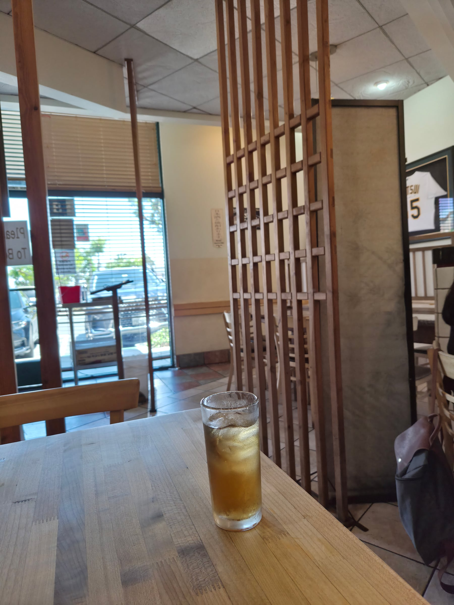
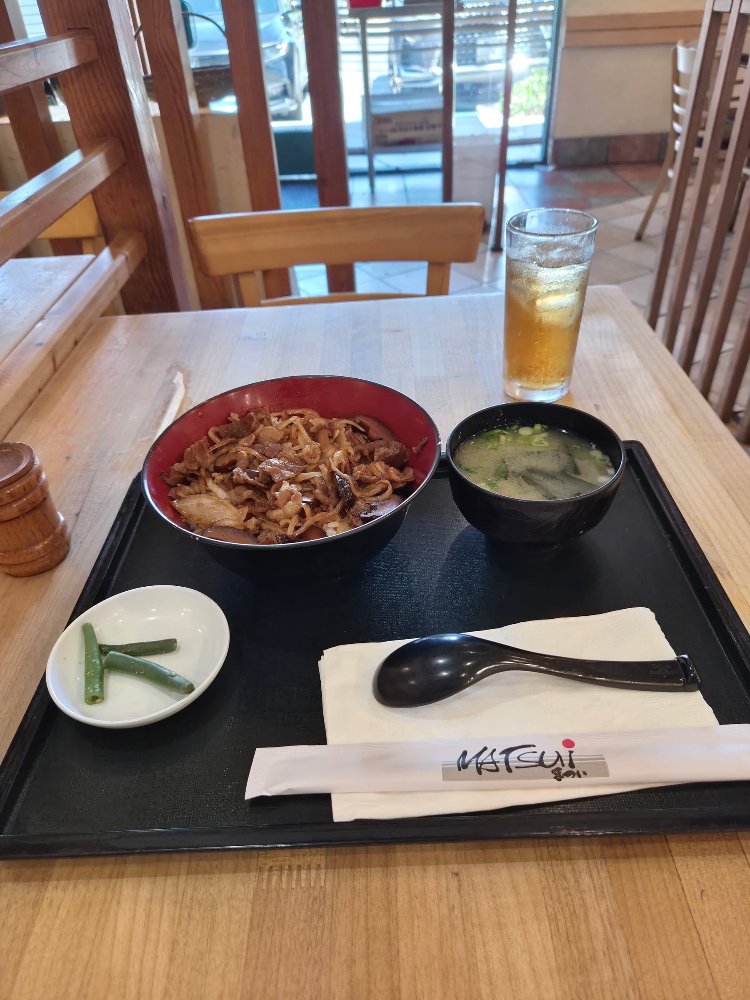

The vibes of this place were quite nice, going inside really reminded me of family owned restaurants in japan. Wood panneling everywhere, plenty of single person seating, old japanese couples having lunch, older physical menus, and they served barley tea!

The Beef bowl was alright. It was beef, mushroom and onions. The flavor profile was good, but it was just too salty for my taste. The other food looked just as good, but I'm worried they oversalt everything they make. 

Overall, the vibes were pretty great, but the food could have been better.
