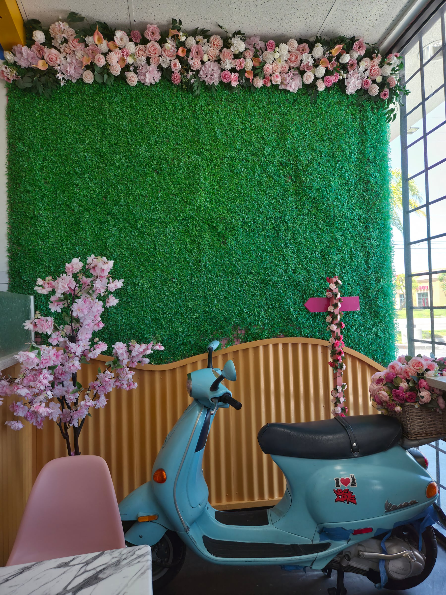
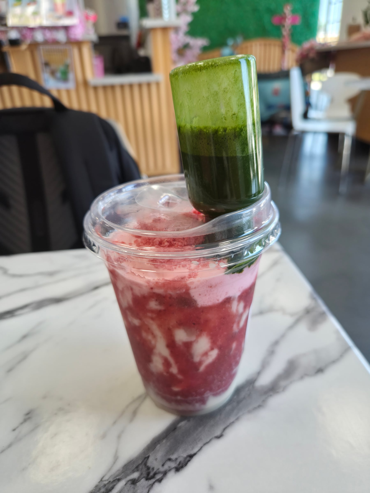

I originally wanted to come here because of the flip bottles for the drinks, which I thought was cool. I never had it before, and the cafe also looked like a fine spot to study in.

The Cafe itself had some cool interior decoration. A problem that I noticed was that it seemed somewhat painted-over, in a sense. They had just rebranded this from a boba store, and were trying to go for a full vietnamese cafe aesthetic (Flowers, plants everywhere, lots of nature). The problem was that the decor seemed to fall flat and just made the whole thing look somewhat fake. I'm not sure how else to describe it. The plants there were mostly fake, with few living. The living plants, while not small, just didn't measure up to the jungle that real viet cafes are. I think somebody who doesn't know what the cafe is trying to ape and seeing it with no bias would like it, and that's what my rating reflects. But it falls very short of the real deal.

They had a cool bike insta picture spot though! All the best cafes need one of those. It'll probably help them get popular, along with the flip bottles

The drinks themselves do stand on their own feet though. I came for the flip bottle, but the matcha actually ended up being not bad. I wasn't the biggest fan of the freeze-dried strawberry bits in the starwberry matcha I got, but I can see some people liking it. It definitely looks good at least. 

Overall, the cafe is inoffensive. The decor is good enough and the drink is alright. The problem is that in south bay LA, it really isn't enough to be good enough. I think it'll do fine because it's in torrance, but 15 minutes north is gardena, and the cafes there would eat this places breakfast, lunch and dinner.